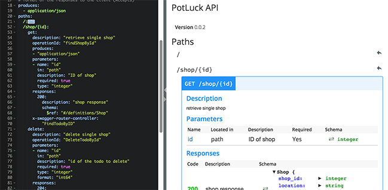
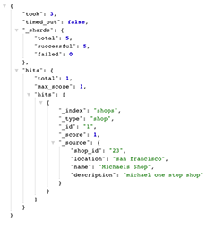

# Potluck API (Rest)
API built using traditional REST endpoints and Swagger.


##Swagger Developer
To start editing swagger API model you can use the built in editor: 


```
swagger project edit
```
Alternatively you can edit the .yaml file directly
swagger/potluckapi/api/swagger/swagger.yaml


##ElasticSearch
We are using elastic search to model the database.

You can run a local elasticsearch instance locally using docker https://hub.docker.com/_/elasticsearch/ or you can spin up a AWS Elastic search instance. 


To populate it with test data you can use curl with the following command: 


```
curl -XPUT 'localhost:32771/shops/shops/1?pretty' -d'
{
    "shop_id" : "23",
    "location" : "san francisco",
    "name" : "Michaels Shop",
    "description" : "michael one stop shop"
}' 
```

You can search elasticsearch via the browser to verify that it is working:
```
http://localhost:32771/_search?q=*
```

##Database Schema
Modeling the database schema using Mysql workbench. 

```
Shops
_ShopsId


Product
_productId
```